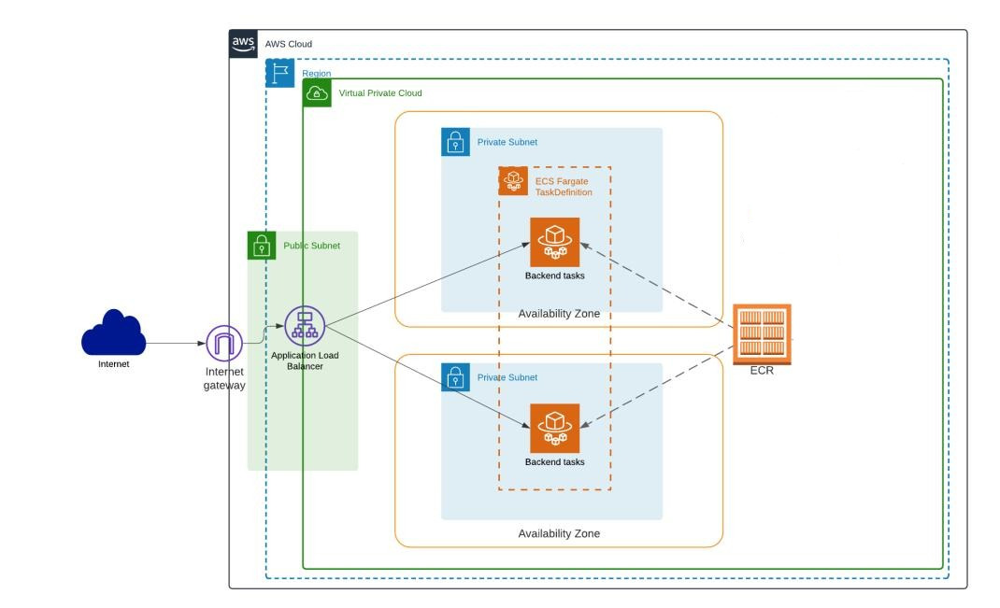

# Toluna assingment



## Script to run

```bash
terraform apply --auto-approve
```

## The exercise

> - Create a free account in AWS
>
> - Deploy a web server that serves a "hello world" (you can take it from DockerHub for example) (use ECS or EKS, your choice)
>
> - Define a cloudwatch alert triggered when the container receives requests. It should send a message to your email when triggered.
>
> __Guidelines__:
>
> - Security is very important to us.
> - Try to be mindful of cost.
> - Use Terraform
>
> __Super important__:
>
> - The environment should be fully automated and be built and torn down with a script.
> - Your repo should include some documentation
> - The exercise should work out of the box without code tweaks according to the instructions you provided

## The code include 8 modules

### IAM

- Policy
- Role
- Role Attachment
- Inputs - `vars.tf`
  - `effect`
  - `actions`
  - `principal_type`
  - `principal_identifiers`
  - `role_name`
  - `policy_arn`
- Outputs - `output.tf`
  - `aws_iam_role_arn`

### VPC

- 1 Private route table
- 2 Private subnets
- 2 Public subnets
- Inputs - `vars.tf`
  - `vpc_cidr_block`
  - `instance_tenancy`
  - `enable_dns_support`
  - `enable_dns_hostnames`
  - `env`
  - `region`
  - `subnets`
- Outputs - `output.tf`
  - `vpc_id`
  - `public_subnets_ids`
  - `private_subnet_ids`

### Security Groups (sg)

- SG for ALB
- SG for ECS
- Inputs - `vars.tf`
  - `vpc_id`
  - `alb_sg_ingress`
  - `alb_sg_egress`
  - `ecs_sg_ingress`
  - `ecs_sg_egress`
- Outputs - `output.tf`
  - `sg_id_alb`
  - `sg_id_ecs`

### ALB

- Load balancer listener
- Target group
- Inputs - `vars.tf`
  - `vpc_id`
  - `alb_sg_ids`
  - `subnet_ids`
  - `tg_ecs_fargate_port`
  - `tg_ecs_fargate_protocol`
  - `tg_ecs_tg_type`
  - `enable_deletion_protection`
- Outputs - `output.tf`
  - `tg_ecs_fargate_arn`
  - `lb_dns_name`

### ECR

- Data source `aws_ecr_repository`
- VPC Endpoint
- Inputs - `vars.tf`
  - `env`
  - `region`
  - `vpc_id`
  - `vpc_endpoint_type`
  - `private_dns_enabled`
  - `private_subnet_ids`
  - `security_group_ids`

### ECS

- ECS Cluster
- Task definition
- ECS Service
- Inputs - `vars.tf`
  - `env`
  - `aws_account_id`
  - `image_arn`
  - `image_name`
  - `container_port`
  - `cpu`
  - `memory`
  - `desired_count`
  - `private_subnet_ids`
  - `security_group_ids`
  - `tg_ecs_fargate_arn`

### SNS

- Topic
- Topic Subscription
- Inputs - `vars.tf`
  - `topics`  
  - `protocol`
  - `endpoint`
- Outputs - `output.tf`
  - `sns_topics_arns`

### ALARM

- Cloudwatch Alarm
- Inputs - `vars.tf`
  - `alarm_name`
  - `comparison_operator`
  - `evaluation_periods`
  - `metric_name`
  - `namespace`
  - `period`
  - `statistic`
  - `threshold`
  - `alarm_description`
  - `alarm_actions`
  - `dimension`
